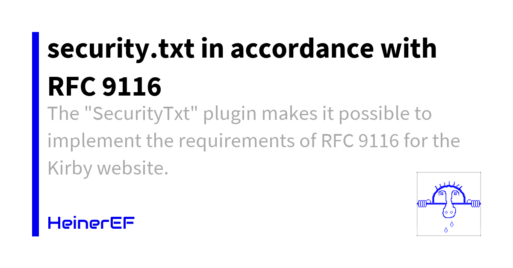

# Kirby Plugin: SecurityTxt



On August 6, 2026, *heise.de* published an article [Missing contact option: Germany is sleeping on security via security.txt](https://heise.de/-11402351), drew attention to a report from the German Federal Office for Information Security (**BSI**) stating that too many websites are failing to use the established contact method for cybersecurity incidents as specified in **[RFC 9116](https://www.rfc-editor.org/info/rfc9116/)**.

This “**SecurityTxt**” plugin makes it possible to implement the requirements of **RFC 9116** in the “*Kirby style*”. It does not *yet* support "PGP signatures"; even the German BSI does not sign its "`security.txt`" file (as of September 4, 2026).

The plugin also includes a "`securitytxt.yml`" blueprint, which provides the necessary input fields on the panel's dashboard (home page). It also provides important guidance and strategies regarding website operators’ legitimate concerns about data protection, particularly concerning critical email addresses.
Details on how to set up these input fields are described in the "**Setup**" section.


## Installation

### Download

[Download](https://github.com/HeinerEF/kirby-securitytxt/archive/master.zip) the contents of this repository as ZIP file.

Rename the **extracted** folder to `heineref_securitytxt` and copy it into the `site/plugins/` directory in your Kirby project. If it does not exist, create a new directory `site/plugins/` first.
This file `README.md` therefore receives the path `site/plugins/heineref_securitytxt/README.md`.

### Composer

```html
composer require HeinerEF/kirby-securitytxt
```

### Git submodule

If you have used git in your project before:

```html
git submodule add https://github.com/HeinerEF/kirby-securitytxt.git site/plugins/heineref_securitytxt
```


## Setup

### Blueprint


In the existing file "`site/blueprints/site.yml`", add the following lines at the end of the section containing the fields and sections:

```YML
  # security.txt tab
  securitytxt: tabs/securitytxt
```

This assumes that the Panel’s dashboard (home page) already uses tabs, meaning the section of the file containing the fields and sections begins as follows:

```YML
tabs:
```

Otherwise, indent this section of the file containing the fields and sections twice and add the following at the beginning of this section:

```YML
tabs:
  content:
    label:
      en: Site
      de: Website
    icon: folder-structure
```
You may need to adjust these lines to match the YML code in this file if you encounter errors in the panel.

The goal is for the fields from the file "`site/plugins/heineref_securitytxt/blueprints/tabs/securitytxt.yml`" are displayed in the panel’s dashboard (home page) and that their content is stored—at least for admins or similar users—on the corresponding content page (usually in the file "`/content/site.txt`" or "`/content/site.en.txt`").


### Contents

On the input page of the panel dashboard (home page), after successfully setting up the panel dashboard blueprint, there is a tab labeled "**`security.txt`**" that must be visited **once** after setup **to fill out the necessary input fields**.

For example, you can enter the following in the "**Security Base Text**" field:

># RFC 9116: security.txt
># ----------------------
>
># Our security address
>Contact: mailto:bugs@example.com
>Contact: tel:+49-9999-99999-999
>Contact: %url%/report-security-vulnerabilities
># Preferred-Languages
>Preferred-Languages: de, en
># Our security policy
>Policy: %url%/security-policy
># Our security acknowledgments page
>Acknowledgments: %url%/hall-of-fame

The text you enter is automatically supplemented with the "`Expires: `" date based on the other input fields and the "`Canonical: `" link to the "`security.txt`" file.
In addition, all instances of "`%url%`" in the text above are replaced with the website’s URL (a URL beginning with "`https://`" or "`http://`". The latter format is not permitted according to RFC 9116 but may occur on development servers). For multilingual websites, the replaced URL does NOT include the language code (such as "`/en`"); if needed, you must enter such a code in the text field! This replacement is useful for testing this plugin on development and staging servers.

Use "`Contact: `"—possibly multiple times—to specify how researchers should report security vulnerabilities, e.g., via an email address (starting with "`mailto:`"), a phone number (starting with "`tel:`"), and/or **preferably to reduce the potential for abuse**, a website (URL must start with "`https://`" [or "`%url%/`"]) containing the contact details of the "security contact address," such as "`bugs@example.com`".
These are listed in order of preference, with the first entry representing the preferred contact method, the second entry the second-preferred contact method, and so on. In the example above, the first email address ("`bugs@example.com`") is the preferred contact method.
This "`Contact: `" field **must** appear **at least once** in a "`security.txt`" file.

The optional "`Preferred-Languages: `" field can be used to specify a list of natural languages preferred for submitting security reports. This list can contain multiple values (e.g., "`de, en`") separated by commas. The values in this list are language identifiers (as defined in RFC 5646).
If this field is missing, security researchers may assume that English is the language to be used (in accordance with Section 4.5 of RFC 2277).
The order in which they are listed does not indicate their priority; the listed languages are intended to have equal priority.
If the "`Preferred-Languages: `" field is included, at least one language must be specified.
The "`Preferred-Languages: `" field must **not appear more than once** in a "`security.txt`" file.

The optional "`Policy: `" field contains a link to the page where the vulnerability disclosure policy can be found. This can help security researchers better understand the organization’s approach to reporting vulnerabilities.
If this field specifies a web URI, it must begin with "`https://`".

The optional "`Acknowledgments: `" field contains a link to a page that recognizes security researchers for their reports. The linked page should include a list of security researchers who reported vulnerabilities and helped resolve them. Organizations should take care to restrict the disclosure of information about vulnerabilities to prevent future attacks.
If this field specifies a web URI, it must begin with "`https://`".


## Requirements

This plugin was developed using **Kirby 5.x** and has been tested up to **Kirby 3.x**.

It does not work as is with older versions of Kirby.


## Disclaimer

This plugin is provided "**as is**" with no guarantee. Use it at your own risk and always test it yourself before using it in a production environment.


## License

[**MIT**](https://github.com/HeinerEF/kirby-securitytxt/blob/main/LICENSE.md)

It is not permitted to use this plugin in any project that promotes racism, sexism, homophobia, animal abuse, violence or any form of hate speech.

## Credits

- [heise.de: Missing contact option: Germany is sleeping on security via security.txt](https://heise.de/-11402351)
- [RFC 9116](https://www.rfc-editor.org/info/rfc9116/)